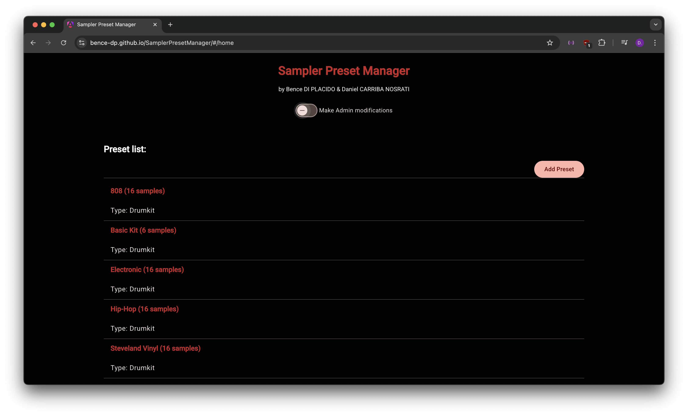
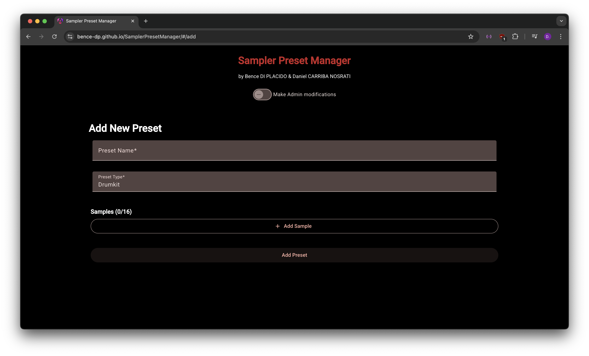
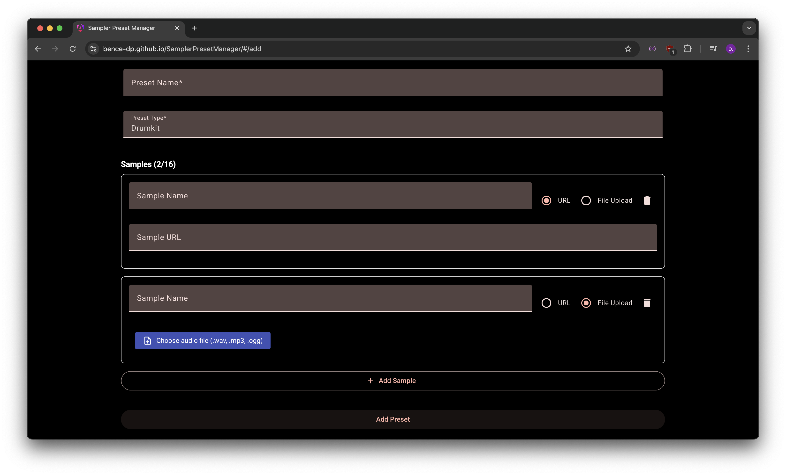
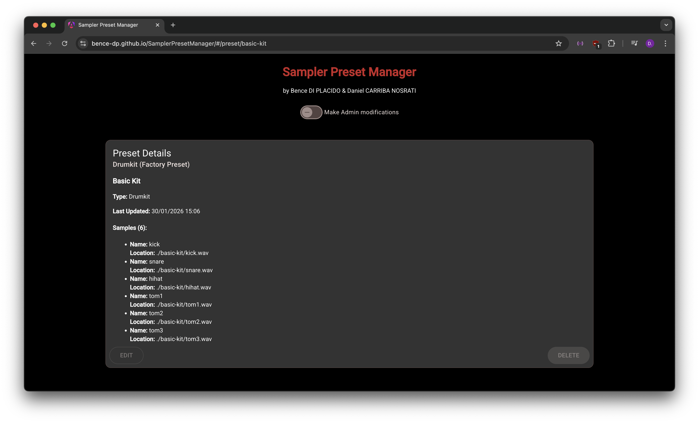
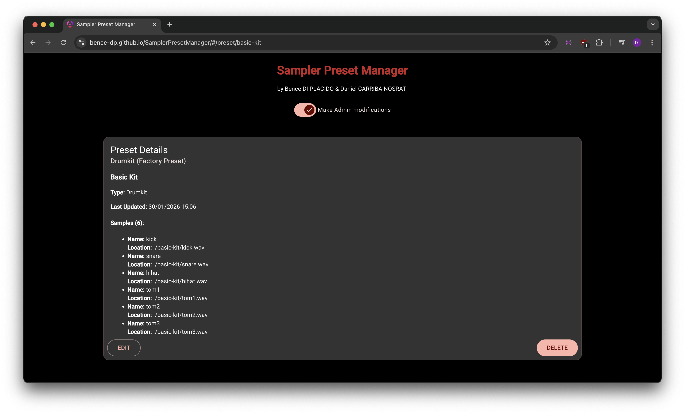
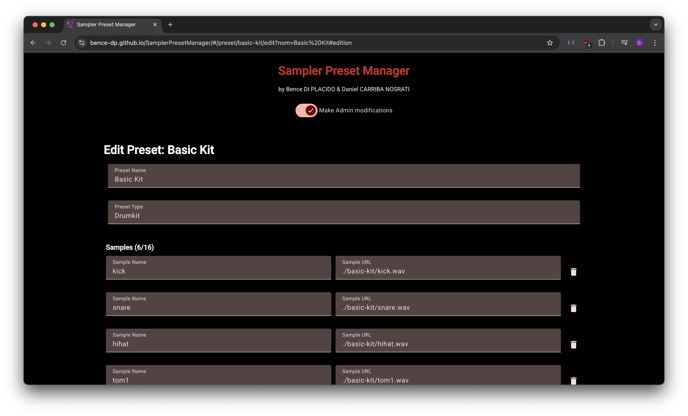

# Sampler

This Sampler project was made for the Web course at Université Côte d'Azur.


## Authors

- Bence DI PLACIDO
- Daniel CARRIBA NOSRATI

<!-- ## Requirements

- [Node.js](https://nodejs.org/) is required.

## Clone the repository

```bash
git clone https://github.com/Bence-dp/Sampler.git
cd Sampler
``` -->

## Content

- the `client/` directory contains the sampler client website.
- the `server/` directory contains the server, i.e. the back-end, of the project.
- the `preset-manager/` directory contains an Angular app to manage the sampler presets. 

<!-- ## How to use

To run the project, first run the server using [Node.js](https://nodejs.org/), and then run the client (with [Live Server for Visual Studio Code](https://marketplace.visualstudio.com/items?itemName=ritwickdey.LiveServer) for example).

You can also run the `Sampler Preset Manager` Angular app, to view, edit, add and delete the sampler's presets, as well as their samples.

### Run the server

The server is running on https://samplerserver.onrender.com/

To run it locally:

```bash
cd server
npm i
npm run dev
```

### Run the client

You may run the client with [Live Server for Visual Studio Code](https://marketplace.visualstudio.com/items?itemName=ritwickdey.LiveServer) or any other local development server.

To run the client with [Live Server for Visual Studio Code](https://marketplace.visualstudio.com/items?itemName=ritwickdey.LiveServer):

```bash
cd client
code .
```

then `Right Click` on `index.html` and select `Open with Live Server`.

### Run the `Sampler Preset Manager` Angular app

```bash
cd preset-manager
npm i
ng serve
``` -->

## How to use

### The Sampler client (in `client/`)

The sampler website is running on the following url:

https://bence-dp.github.io/SamplerClient/

### The Back-end (in `server/`)

The Back-end of the project is running on [Render](https://render.com/) on the following url: 

https://samplerserver.onrender.com/

### The `Sampler Preset Manager` Angular app (in `preset-manager/`)

The `Sampler Preset Manager` Angular app is running on the following url:

https://bence-dp.github.io/SamplerPresetManager/#/home


## Implemented features

### The Sampler client (in `client/`)

#### The Sampler

- A sampler containing multiple presests


- A canvas to see the waveform of the currently played sound
- Trimbars to adjust the currently played sound (the trimbars are remembered for each sound)


#### Recorder to record new audio samples

Example showing how to record and add a new audio sample :

1) Click on `Record` to start recording your audio sample, and `Stop` to stop the recording.


2) Upload the audio sample to the server using `Send to Server`.


3) Access your recorded audio samples in the new preset that was added.


#### Keyboard support

- You can play the sampler using the keyboard keys: 1, 2, 3, 4, A, Z, E, R, Q, S, D, F, W, X, C, V.

- Works on either QWERTY or AZERTY keyboards.


#### MIDI support

- Has MIDI support


#### Responsive layout

The website has a responsive layout when resizing the window.


### The Back-end (in `server/`)

- The Back-end of the project is running on [Render](https://render.com/) on the following url: https://samplerserver.onrender.com/

- The `json` files of the presets are stored in a database in [MongoDB](https://www.mongodb.com/).

### The `Sampler Preset Manager` Angular app (in `preset-manager/`)

#### View the presets

- On the home page (https://bence-dp.github.io/SamplerPresetManager/#/home) you can see the list of all presets.



#### Add a new preset

- By clicking on the `Add Preset` button on the top right of the preset list, you are redirected to https://bence-dp.github.io/SamplerPresetManager/#/add




- You can specify the name of the preset as well specify the type of the preset (which is "Drumkit" by default).

- With the `+ Add Sample` button you can add up to 16 samples to the preset.



- For each new sample you can specify a name, and you can choose between specifying a url or uploading an audio file. 

- Each sample can be removed using the trash icon on the right side.

- Using the `Add Preset` button you can add the preset including the samples to the sampler.

- To not add a new preset, you can go back to the home page by pressing the title `Sampler Preset Manager` on top of the screen.

#### View the details of a preset and edit/delete a preset

- By clicking on a preset from the Preset list on the home page, you are redirected to https://bence-dp.github.io/SamplerPresetManager/#/preset/name, where `name`is the name of the preset. You can access the details of any preset by specifying the name in the url. Example: https://bence-dp.github.io/SamplerPresetManager/#/preset/808

- The details are displayed as followed:



- In order to edit or delete a preset you must toggle on the `Make Admin modifications` slider.



- To delete a preset you may click the `DELETE` button.

- To edit a preset you may click the `EDIT` button. By click this button you are redirected to the `/edit` page. Example: https://bence-dp.github.io/SamplerPresetManager/#/preset/basic-kit/edit?nom=Basic%20Kit#edition 




- You can now edit the name and type of the preset. You can also edit the name and url for each sample, as well as delete and add new samples. 

- Using the `Save` button you can save your modifications.

- You can go back to the home page by pressing the title `Sampler Preset Manager` on top of the screen.
