# Sampler

This Sampler project was made for the Web course at Université Côte d'Azur.

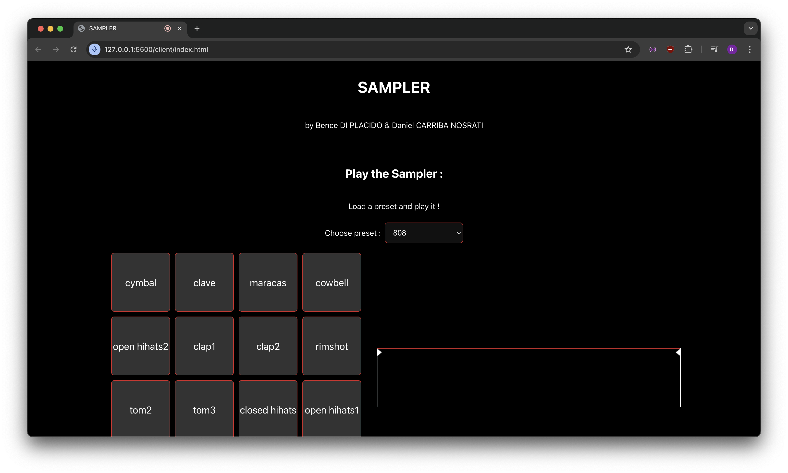

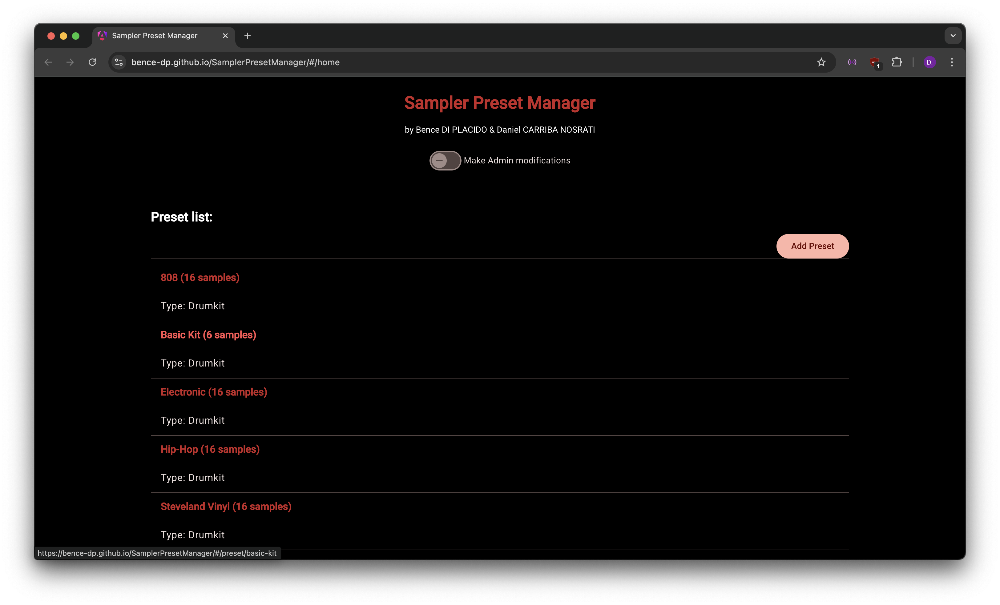

## Authors

- Bence DI PLACIDO
- Daniel CARRIBA NOSRATI

This project was made using the slides and the provided examples from Michel BUFFA.

<!-- ## Requirements

- [Node.js](https://nodejs.org/) is required.

## Clone the repository

```bash
git clone https://github.com/Bence-dp/Sampler.git
cd Sampler
``` -->

## Content

- the `client/` directory contains the sampler client website.
- the `server/` directory contains the server, i.e. the back-end, of the project.
- the `preset-manager/` directory contains an Angular app to manage the sampler presets. 

<!-- ## How to use

To run the project, first run the server using [Node.js](https://nodejs.org/), and then run the client (with [Live Server for Visual Studio Code](https://marketplace.visualstudio.com/items?itemName=ritwickdey.LiveServer) for example).

You can also run the `Sampler Preset Manager` Angular app, to view, edit, add and delete the sampler's presets, as well as their samples.

### Run the server

The server is running on https://samplerserver.onrender.com/

To run it locally:

```bash
cd server
npm i
npm run dev
```

### Run the client

You may run the client with [Live Server for Visual Studio Code](https://marketplace.visualstudio.com/items?itemName=ritwickdey.LiveServer) or any other local development server.

To run the client with [Live Server for Visual Studio Code](https://marketplace.visualstudio.com/items?itemName=ritwickdey.LiveServer):

```bash
cd client
code .
```

then `Right Click` on `index.html` and select `Open with Live Server`.

### Run the `Sampler Preset Manager` Angular app

```bash
cd preset-manager
npm i
ng serve
``` -->

## How to use

### The Sampler client (in `client/`)

The sampler website is running on the following url:

https://bence-dp.github.io/SamplerClient/

### The Back-end (in `server/`)

The Back-end of the project is running on [Render](https://render.com/) on the following url: 

https://samplerserver.onrender.com/

### The `Sampler Preset Manager` Angular app (in `preset-manager/`)

The `Sampler Preset Manager` Angular app is running on the following url:

https://bence-dp.github.io/SamplerPresetManager/#/home


## Implemented features

### The Sampler client (in `client/`)

#### The Sampler

- A sampler containing multiple presests

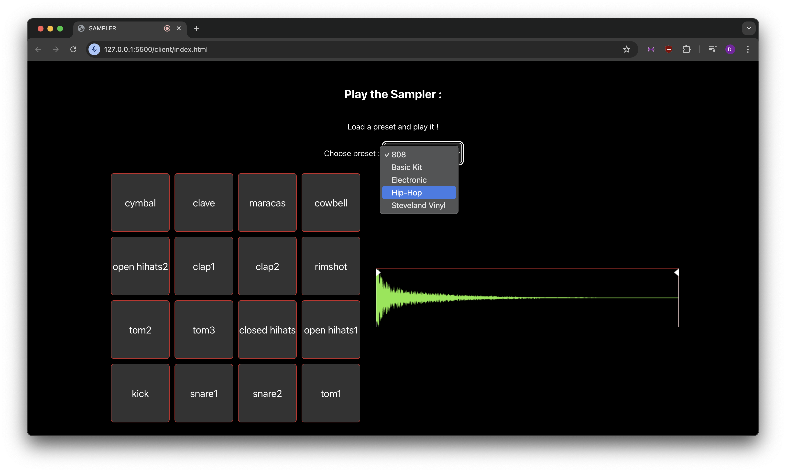

- A canvas to see the waveform of the currently played sound
- Trimbars to adjust the currently played sound (the trimbars are remembered for each sound)

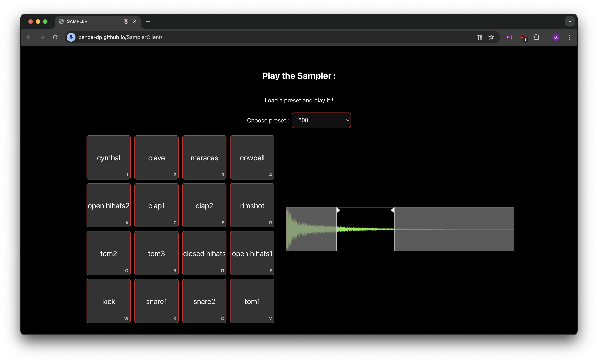

#### Recorder to record new audio samples

Example showing how to record and add a new audio sample :

1) Click on `Record` to start recording your audio sample, and `Stop` to stop the recording.

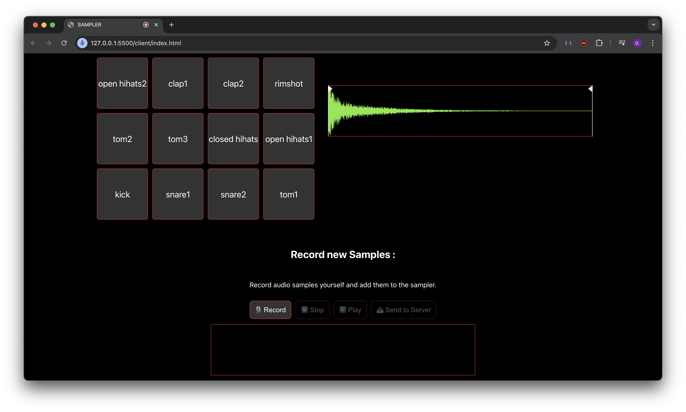


2) Upload the audio sample to the server using `Send to Server`.

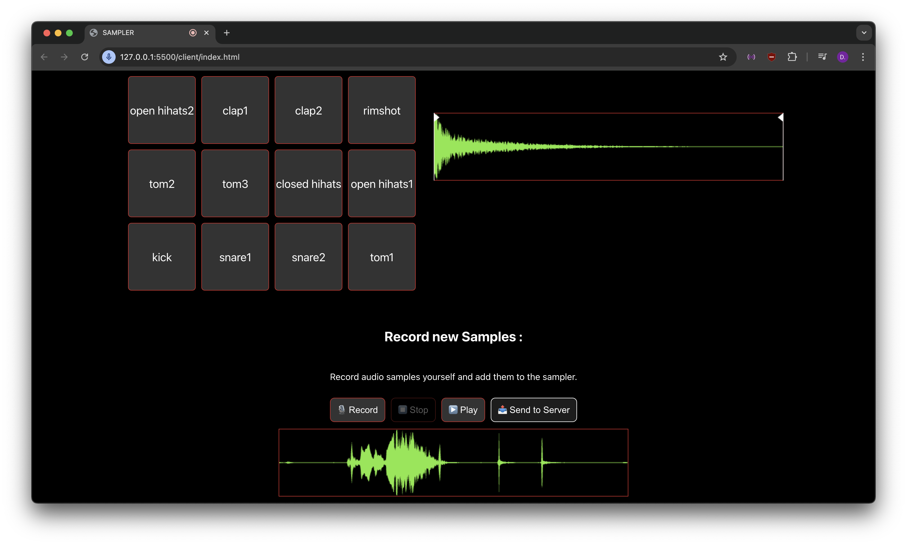

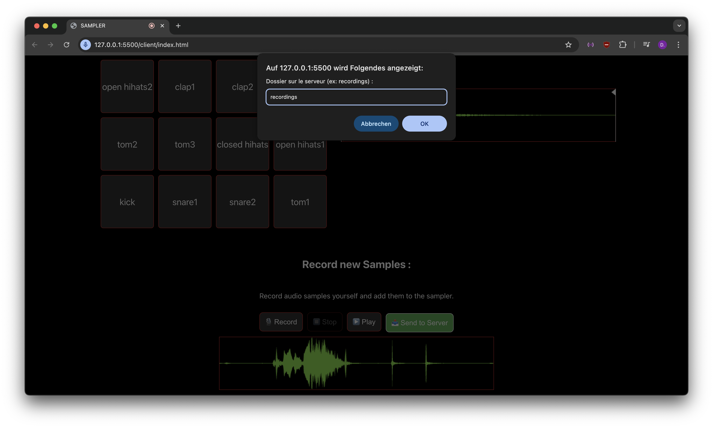


3) Access your recorded audio samples in the new preset that was added.

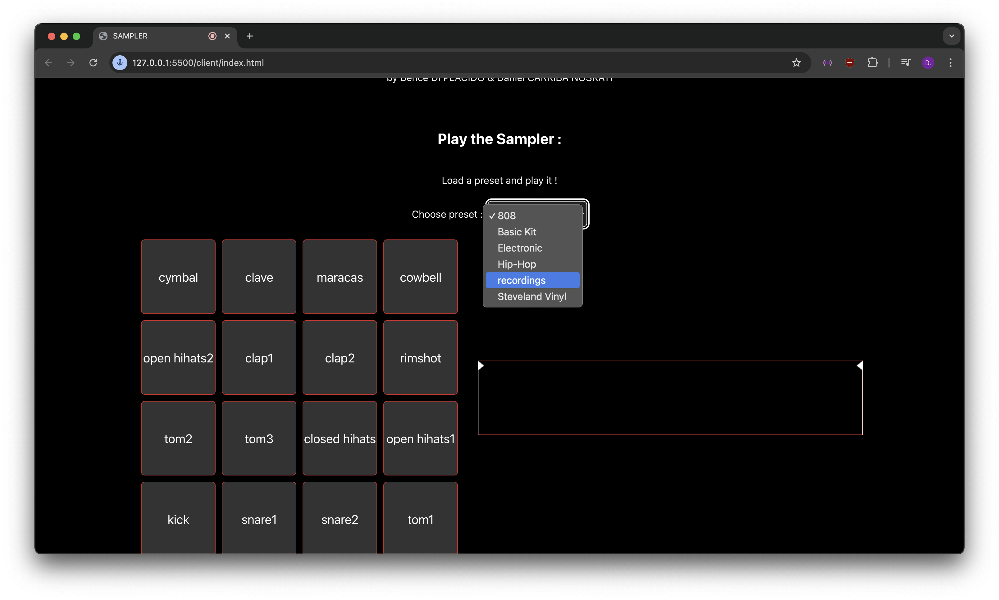

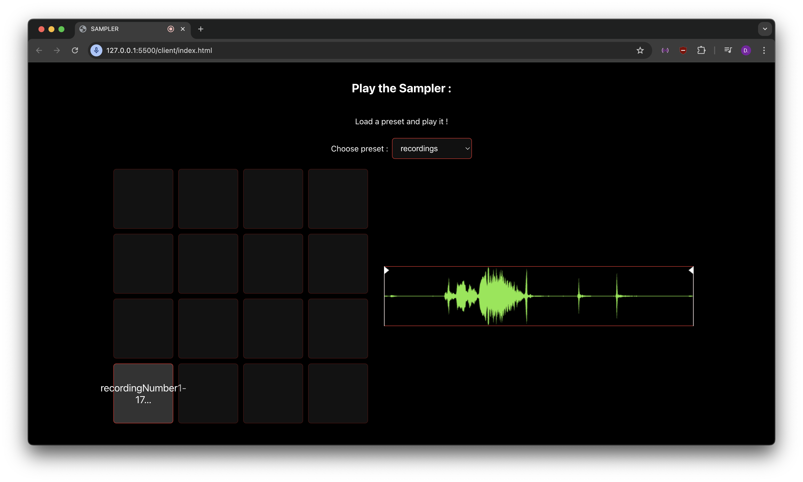

#### Keyboard support

- You can play the sampler using the keyboard keys: 1, 2, 3, 4, A, Z, E, R, Q, S, D, F, W, X, C, V.

- Works on either QWERTY or AZERTY keyboards.

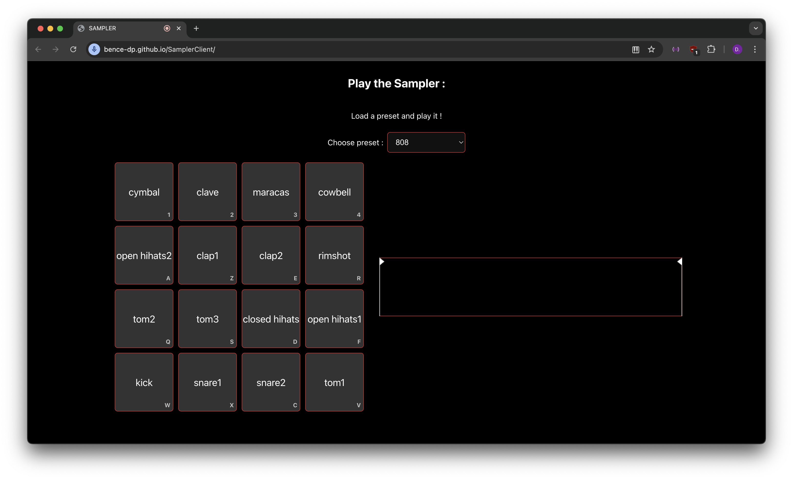

#### MIDI support

- Has MIDI support

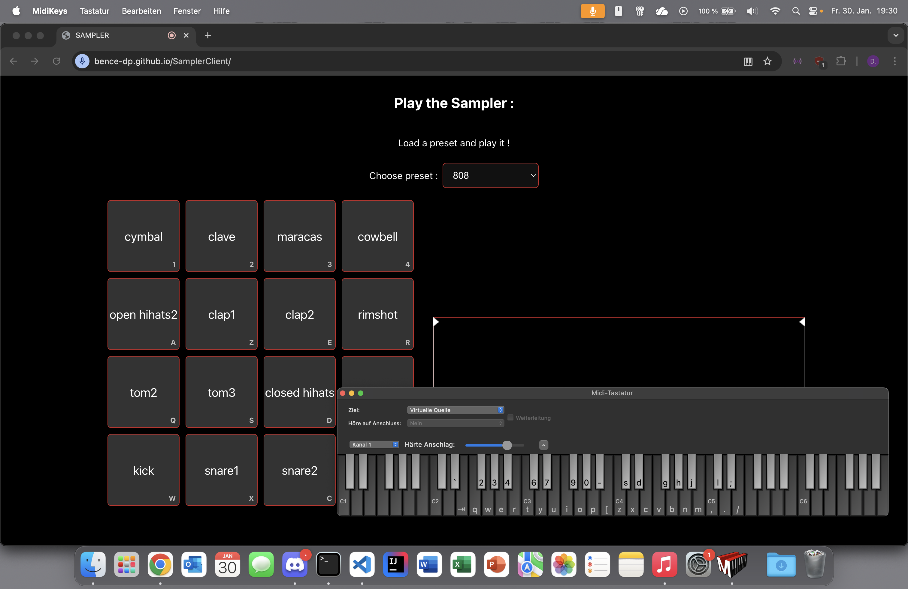

#### Responsive layout

The website has a responsive layout when resizing the window.


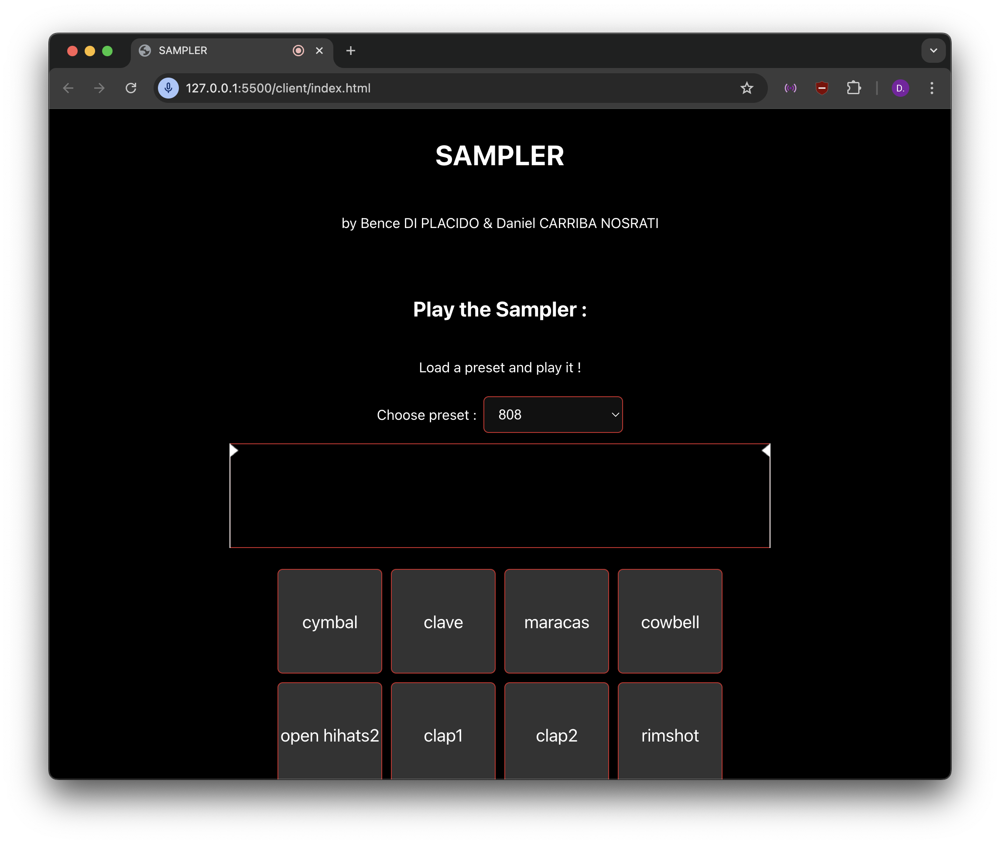

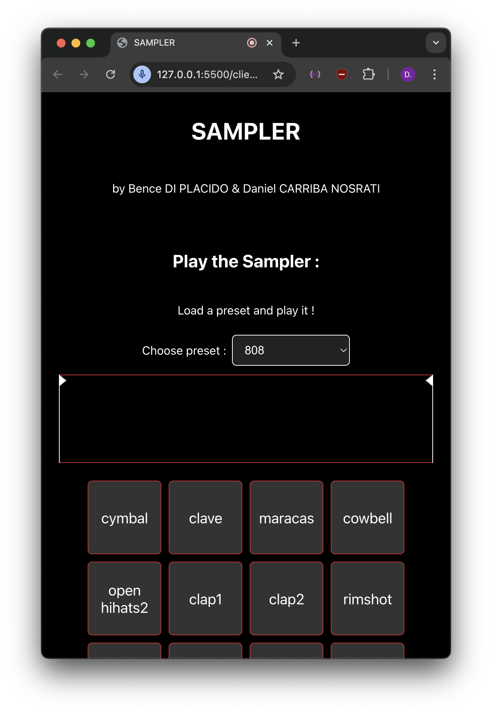

### The Back-end (in `server/`)

The Back-end of the project is running on [Render](https://render.com/) on the following url: 

https://samplerserver.onrender.com/

### The `Sampler Preset Manager` Angular app (in `preset-manager/`)


